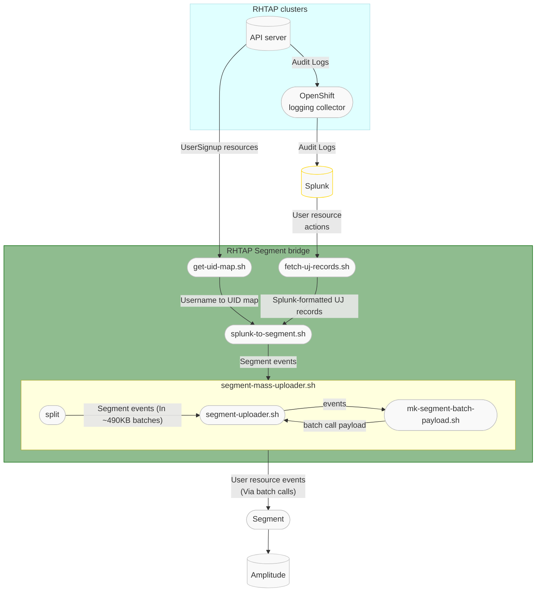

# segment-bridge

Bridge selected events from AppStudio into [Segment][1]


**Note:** If you cannot see the drawing above in GitHub, make sure you are not
blocking JavaScript from *viewscreen.githubusercontent.com*.

Given that:

1. The API server audit logs from the RHTAP clusters are being forwarded to
   Splunk
2. Details about the mapping between cluster usernames and anonymized SSO user
   IDs can be found on the *host* clusters in the form of *UserSignup*
   resources

We can send details about the users' activity as seen via the cluster API
server by doing the following on a periodic basis:

1. Read the *UserSignup* resources from the host cluster (via a K8s API or CLI
   call) and generate a table mapping from a cluster username (As found in the
     `status.compliantUsername` field) to SSO user ID (As could be found in the
       `toolchain.dev.openshift.com/sso-user-id` annotation).
2. Upload that table to a Splunk KV store (via the REST API) so it can be used
   via the Splunk `lookup` command.
3. Run a Splunk query to extract all the interesting user activity events from
   the API server audit logs while also converting the cluster usernames to SSO
   user IDs (More details about the needed query below).
4. Stream the returned events into the Segment API.

[1]: https://app.segment.com

## Details about reading the UserSignup resources (get-gid-map.sh)

Following is an example of a UserSignup resource:
```
apiVersion: toolchain.dev.openshift.com/v1alpha1
kind: UserSignup
metadata:
  annotations:
    toolchain.dev.openshift.com/activation-counter: "1"
    toolchain.dev.openshift.com/last-target-cluster: member-stone-stg-m01.7ayg.p1.openshiftapps.com
    toolchain.dev.openshift.com/sso-account-id: "1234567"
    toolchain.dev.openshift.com/sso-user-id: "1234567"
    toolchain.dev.openshift.com/user-email: foobar@example.com
    toolchain.dev.openshift.com/verification-counter: "0"
  creationTimestamp: "..."
  generation: 2
  labels:
    toolchain.dev.openshift.com/email-hash: ...
    toolchain.dev.openshift.com/state: approved
  name: foobar
  namespace: toolchain-host-operator
  resourceVersion: "12345678"
  uid: 12345678-90ab-cdef-1234-567890abcdef
spec:
  states:
  - approved
  userid: f:12345678-90ab-cdef-1234-567890abcdef:foobar
  username: foobar
status:
  compliantUsername: foobar
  conditions:
  - ...
```

The interesting fields for this use case are:

- `metadata.annotations["toolchain.dev.openshift.com/sso-user-id"]` - Contains
  the SSO user ID to be sent to Segment
- `status.compliantUsername` - Contains the username used in the cluster audit
  log.

## Details about sending events to Segment

Segment has a [built-in mechanism for removing duplicate events][ES1]. This
mean that we can safely resend the same event multiple times to increase the
sending process reliability. The duplicate remove mechanism is based on the
`messageid` [common message field][ES2]. We can use the `auditID` field of the
cluster audit log record as the value for this field.

Segment also has a [*batch* call][ES3] that allows for sending multiple events
within a single API call. There is a limit of 500KB data size per-call, while
individual event JSON records should not exceed 32KB.

The architecture for the event sending logic would then be to repeat the
following logic on an hourly basis:

1. Run a Splunk query to retrieve user journey events in the form of a
   series of JSON objects that match the format of the Segment batch call event
   records.
2. Make adjustments as needed (E.g. username to UID mapping) to generate the
   actual Segment batch call records.
3. Split the stream of records into ~500KB chunks
4. Send each chunk to Segment via a batch call. Attempt this up to 3 times.
  
Since the logic will run on an hourly basis but will query the events from the
last 4 hours, it will automatically attempt to send each event up to 4 times
(Not including retries for failed API calls). Monitoring logic around the
sending job should allow us to determine if the job failed to complete more
then 4 times in a row and issue an appropriate alert.

[ES1]: https://segment.com/blog/exactly-once-delivery/
[ES2]: https://segment.com/docs/connections/spec/common/
[ES3]: https://segment.com/docs/connections/sources/catalog/libraries/server/http-api/#batch

## Running a test environment

### Kwok Container
"Kwok" is a Kubernetes SIGs-hosted project. KWOK is an abbreviation for Kubernetes Without Kubelet. Kwok simply simulates the node's behaviour. As a result, it can mimic a high number of nodes and pods while consuming only a small amount of memory.

To run the Kwok container with the Kwok Kubernetes tool, follow these steps:

1. Bring up the Kwok cluster by running the following command:

```
podman run --rm -d -p 8080:8080 --name kwok-cluster registry.k8s.io/kwok/cluster:v0.3.0-k8s.v1.27.3
```

2. Once the Kwok cluster is up and running, set the cluster details in the OpenShift client with the following command:

```
oc config set-cluster kwok --server=http://127.0.0.1:8080
```

3. Create a new context (you only need to set the cluster once) for the Kwok cluster with the following command:

```
oc config set-context kwok --cluster=kwok
```
4. Set the Kwok context as the current context, if you've previously switched to another cluster, with the following command:
```
oc config use-context kwok
```

Now you can access the cluster using kubectl, e.g.: `kubectl get ns`.

### Setting up a containerized Splunk instance

To set up a containerized Splunk instance, you can use either podman or docker.
Follow these steps:

1. Run the container with the desired configuration:
   ```
   podman run -p 8000:8000 -p 8089:8089 -e "SPLUNK_PASSWORD=YourPassword" -e "SPLUNK_START_ARGS=--accept-license" -it --name splunk_container docker.io/splunk/splunk:latest
   ```
    This command maps port 8000 and port 8089 from the container to the host machine, 
    set a password that is a minimum of 8 characters long (the minimum requirement),
    and accepts the Splunk license.
    For more information about the specific command inputs and options, refer
    to the [Splunk documentation][CS1].
2. Once the container is running, you can log in to the Splunk instance using
   the username `admin` and the password you set up.
3. To access the Splunk [REST API][CS2],
   you can make API calls from outside the container using the `curl` command.
   For example, you can run the following command to search all data:
     ```
     curl -u admin:YourPassword -k https://localhost:8089/services/search/jobs -d search="search *"
     ```
4. If you want to use the Splunk UI, open a web browser on the host and navigate to
   `localhost:8000`.

[CS1]:
https://docs.splunk.com/Documentation/Splunk/9.0.4/Installation/DeployandrunSplunkEnterpriseinsideDockercontainers
[CS2]:
https://docs.splunk.com/Documentation/Splunk/9.0.4/RESTTUT/RESTTutorialIntro

### Building and running the segment-bridge container image

The scripts in this repo can be built into a container image to enable
scheduling and running them on K8s clusters.

To build the image locally, one needs to be logged in to a `redhat.com` account
(With e.g `podman login`) in order to access the base image and then the image
can be built with:
```
podman build -t segment-bridge .
```

The scripts require access to Splunk, Segment and OpenShift credentials. One
way to provide such access is to mount the local `~/.netrc` and
`~/.kube/config` files (Assuming they contain suitable credentials) to the
image with a command like the following:
```
podman run -it --rm \
         -v ~/.netrc:/usr/local/etc/netrc:z \
         -v ~/.kube/config:/usr/local/etc/kube_config:z \
         segment-bridge
```
The following command can be run inside the container to test the full chain of
scripts. This will copy real data from the staging audit logs in Splunk into the
Segment DEV environment:
```
fetch-uj-records.sh | splunk-to-segment.sh | segment-mass-uploader.sh
```

