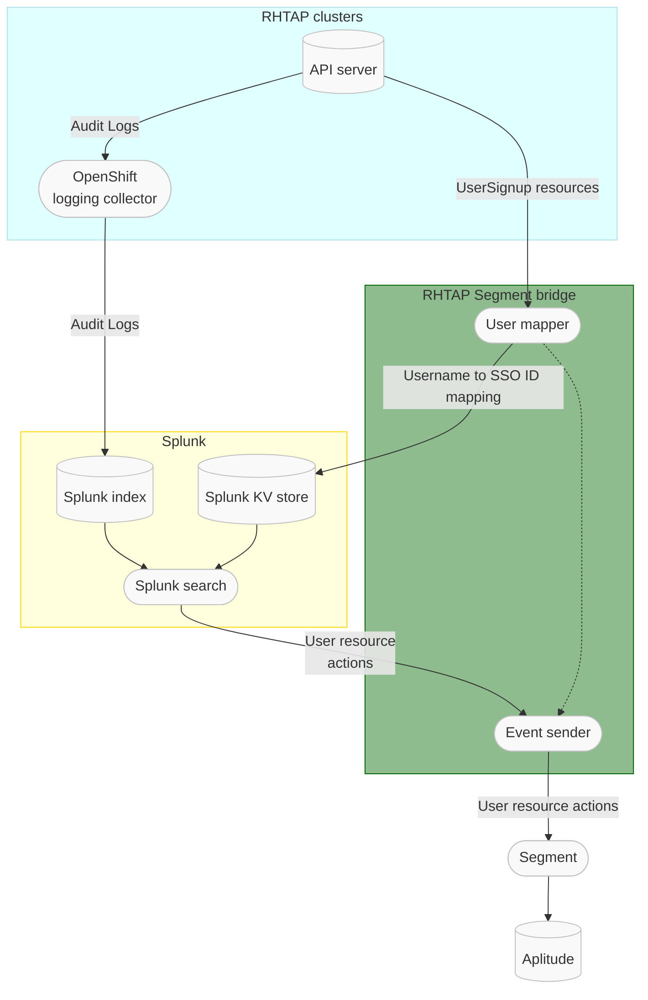

# segment-bridge

Bridge selected events from AppStudio into [Segment][1]


**Note:** If you cannot see the drawing above in GitHub, make sure you are not
blocking JavaScript from *viewscreen.githubusercontent.com*.

Given that:

1. The API server audit logs from the RHTAP clusters are being forwarded to
   Splunk
2. Details about the mapping between cluster usernames and anonymized SSO user
   IDs can be found on the *host* clusters in the form of *UserSignup*
   resources

We can send details about the users' activity as seen via the cluster API
server by doing the following on a periodic basis:

1. Read the *UserSignup* resources from the host cluster (via a K8s API or CLI
   call) and generate a table mapping from a cluster username (As found in the
     `status.compliantUsername` field) to SSO user ID (As could be found in the
       `toolchain.dev.openshift.com/sso-user-id` annotation).
2. Upload that table to a Splunk KV store (via the REST API) so it can be used
   via the Splunk `lookup` command.
3. Run a Splunk query to extract all the interesting user activity events from
   the API server audit logs while also converting the cluster usernames to SSO
   user IDs (More details about the needed query below).
4. Stream the returned events into the Segment API.

[1]: https://app.segment.com

## Details about reading the UserSignup resources

Following is an example of a UserSignup resource:
```
apiVersion: toolchain.dev.openshift.com/v1alpha1
kind: UserSignup
metadata:
  annotations:
    toolchain.dev.openshift.com/activation-counter: "1"
    toolchain.dev.openshift.com/last-target-cluster: member-stone-stg-m01.7ayg.p1.openshiftapps.com
    toolchain.dev.openshift.com/sso-account-id: "1234567"
    toolchain.dev.openshift.com/sso-user-id: "1234567"
    toolchain.dev.openshift.com/user-email: foobar@example.com
    toolchain.dev.openshift.com/verification-counter: "0"
  creationTimestamp: "..."
  generation: 2
  labels:
    toolchain.dev.openshift.com/email-hash: ...
    toolchain.dev.openshift.com/state: approved
  name: foobar
  namespace: toolchain-host-operator
  resourceVersion: "12345678"
  uid: 12345678-90ab-cdef-1234-567890abcdef
spec:
  states:
  - approved
  userid: f:12345678-90ab-cdef-1234-567890abcdef:foobar
  username: foobar
status:
  compliantUsername: foobar
  conditions:
  - ...
```

The interesting fields for this use case are:

- `metadata.annotations["toolchain.dev.openshift.com/sso-user-id"]` - Contains
  the SSO user ID to be sent to Segment
- `status.compliantUsername` - Contains the username used in the cluster audit
  log.
